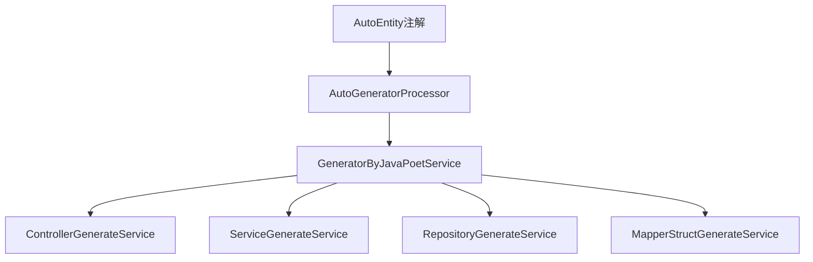

# 技术实现

## 核心架构

## 核心组件说明

### 1. AutoEntity注解
- 位置：`core.annotation.AutoEntity`
- 功能：标记需要生成代码的实体类
- 主要参数：
  - basePath: 生成代码的基础路径
  - generateFileType: 指定生成的文件类型(Controller/Service/Repository等)
  - controllerExclude: 指定要排除的Controller方法

### 2. AutoGeneratorProcessor
- 位置：`core.processors.AutoGeneratorProcessor`
- 功能：注解处理器，扫描被@AutoEntity标记的类
- 处理流程：
  1. 初始化加载配置
  2. 扫描被注解的类
  3. 创建生成上下文(GeneratorContext)
  4. 调用GeneratorByJavaPoetService生成代码

### 3. GeneratorByJavaPoetService
- 位置：`core.service.javapoet.GeneratorByJavaPoetService`
- 功能：代码生成服务入口
- 依赖服务：
  - ControllerGenerateService
  - ServiceGenerateService
  - RepositoryGenerateService
  - MapperStructGenerateService

## 代码生成流程
1. 编译时扫描@AutoEntity注解
2. 创建生成上下文(包含实体类信息、配置等)
3. 根据配置调用对应的生成服务
4. 使用JavaPoet生成Java源代码
5. 写入到指定包路径
